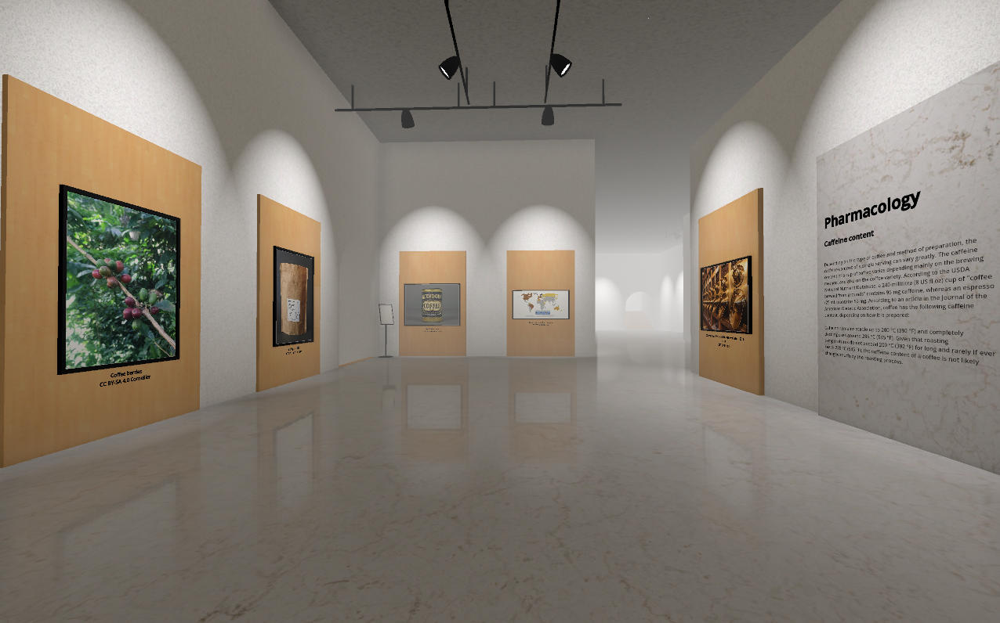
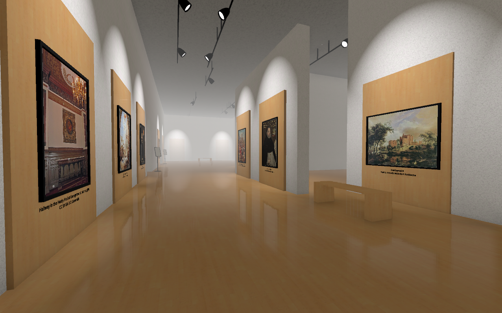
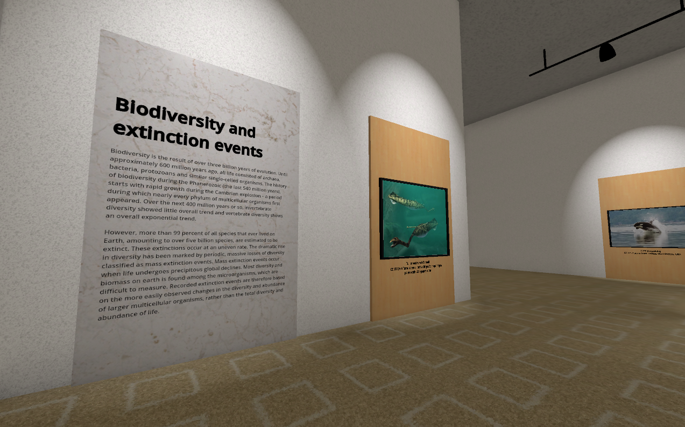
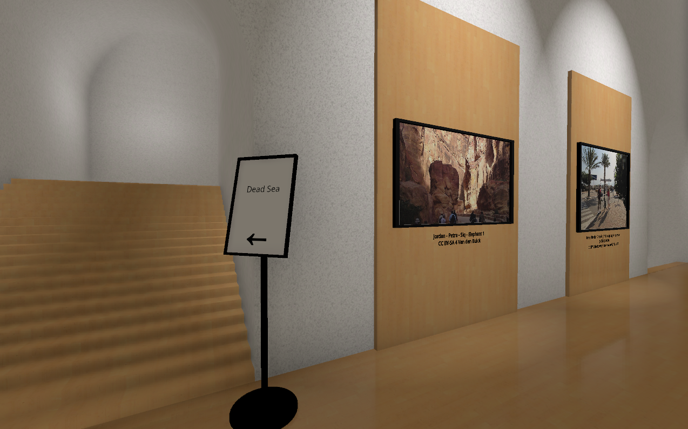

  

[Project homepage](https://may.as/moat)

[You can download a pre-release version of the museum here!](https://github.com/m4ym4y/wikipedia-museum/releases/tag/v0.3.1)

The goal of this project is to make an interactive 3d museum that is generated
procedurally, using content from wikipedia to fill exhibits. The museum is
virtually limitless, allowing you to take doors from one exhibit to another,
depending on what is linked from that wikipedia article.

The text of the article is also inserted as informative plaques on the wall. You
can read about the exhibit while looking at the pictures from it. Images are also
pulled from wikimedia commons in the category corresponding to the article.

Every exhibit is filled with hallways to other exhibits, based on the links in the
current exhibit's wikipedia page. You'll never run out of things to explore!

## Credits

All exhibit content is sourced from Wikipedia and Wikimedia commons. This game is written in the [Godot engine](https://godotengine.org). Textures are from [AmbientCG](https://ambientcg.com/).

- Creator and Programmer: [Maya](https://github.com/m4ym4y)
- Dramaturg: Emma Bee Pernudi-Moon
