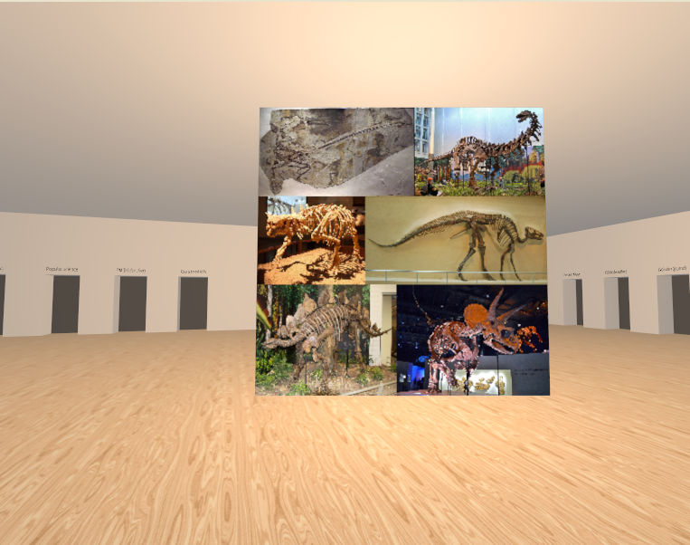
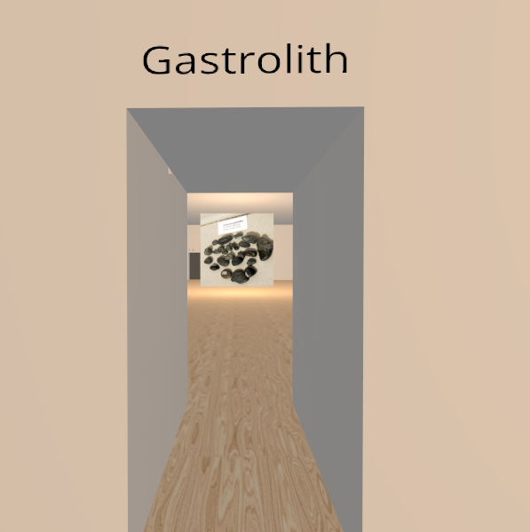

# Wikipedia Museum

(currently being rewritten)

The goal of this project is to make an interactive 3d museum that is generated
on the fly, using content from wikipedia to fill exhibits. The museum is
virtually limitless, allowing you to take doors from one exhibit to another,
depending on what is linked from that wikipedia article.

## Plans

- change from dynamic rectangular rooms to fixed size layouts
- instead of having one wikipedia article be one room, one article can be multiple rooms connected (an 'exhibit')
  - a room will have pre-determined spots where doors and media elements can be inserted
    - could call these things like DoorSlot and DisplaySlot.
      - a DoorSlot will contain a door to another exhibit (so a link is associated to a DoorSlot)
      - a DisplaySlot will contain an image or a plaque with text on it (associated to content in the article)
      - Each of these can be a type of scene that is inserted into the Exhibit, and also associated with an ordinal number. Then the method of 'FillDoorSlot' and 'FillDisplaySlot' can query for the DoorSlots and DisplaySlots that are children of the room.
    - room scene needs a method to fill the next DoorSlot, and a method to fill the next DisplaySlot.
    - a room also needs a method to affix a room at the entrance and exit.
      - For the first room of an exhibit, we can use a room with a DoorSlot (leading back) as the entrance, with an exit attached to the next room of the exhibit.
      - The entrance and exit are simply open, unlike doors which must be opened and closed by interacting (because a door actually triggers content to be loaded). They should be a standard size across the different room layouts. The room scene might need a point element under it in order to say where the entrance and exit of the room are.
  - the exhibit scene would have data associated with it, loaded from the wikipedia article. Another element will be used to process this into a stream of links, images, and paragraphs. The exhibit will assemble rooms, filling them with links and media, until the article is exhausted.
    - there might be some level of curation because there are likely way more links than doors, compared to the slots for media. And we might not want to have every part of the article represented in the exhibit.

- multiplayer features to enable games
  - menu to turn on/off display of what room you're in
  - 'pinging' tool that lets you highlight something in the room, but also lets you highlight a player and announces that in chat
  - this way you could play games like laser tag, racing to a certain destination, etc.
