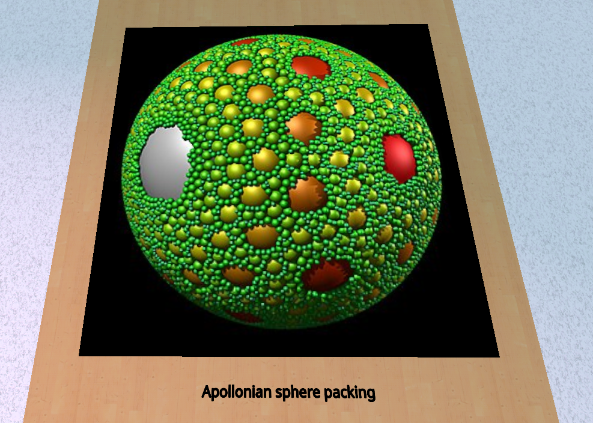
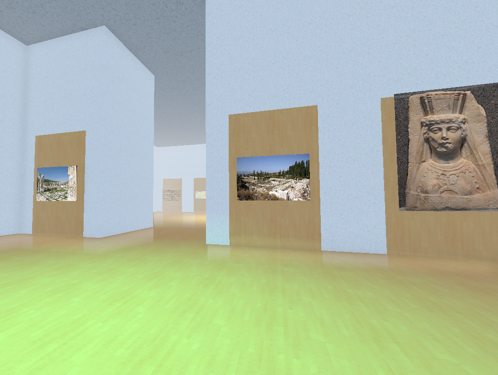

# Wikipedia Museum

[Visit the museum here!!](https://m4ym4y.github.io/wikipedia-museum/)

The goal of this project is to make an interactive 3d museum that is generated
procedurally, using content from wikipedia to fill exhibits. The museum is
virtually limitless, allowing you to take doors from one exhibit to another,
depending on what is linked from that wikipedia article.

## Credits

All museum content is sourced from Wikipedia.

- Creator and Programmer: [Maya](https://github.com/m4ym4y)
- Dramaturg: Emma Bee Pernudi-Moon

## Plans

- add more room layouts
- allow more diverse content to be imported into the exhibit, instead of just images and summary
- improve graphics (esp. textures & lighting)
- add the ability to open the wikipedia page you're currently in in your browser
- multiplayer features to enable games
  - menu to turn on/off display of what room you're in
  - 'pinging' tool that lets you highlight something in the room, but also lets you highlight a player and announces that in chat
  - this way you could play games like laser tag, racing to a certain destination, etc.

## Pages causing bugs

- https://en.wikipedia.org/api/rest_v1/page/summary/Norman_conquest_of_England?redirect=false
