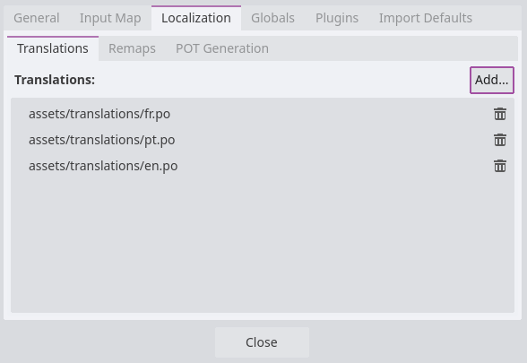
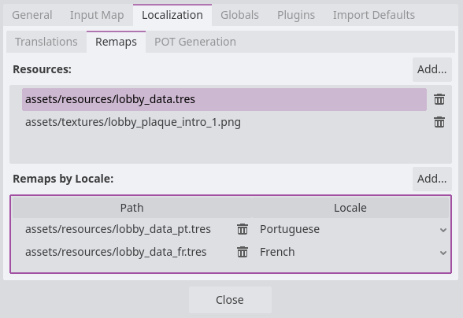

# Translation

Translating the Museum of All Things to another language is very straightforward. Because most of the museum is content from Wikipedia, only the game interface and lobby data needs to be changed.

You do not need to know how to write code in order to do this! :)

This guide will walk you through the steps required to add a new language to the Museum of All Things. You can always [message me](https://may.as), and you can refer to the [original pull request adding multi-language functionality](https://github.com/m4ym4y/museum-of-all-things/pull/59) for some more insights on the process.

## 0. Get your language's wikipedia subdomain

- Go to the wikipedia instance for your language. For instance, if you are translating to Spanish, this would be `es`, as in `es.wikipedia.org`.

## 1. Fork the Museum of All Things

- If you are not familiar with this step, follow [GitHub's guide](https://docs.github.com/en/pull-requests/collaborating-with-pull-requests/working-with-forks/fork-a-repo) to create your own local copy of the Museum of All Things codebase that you can modify.

## 2. Create new translation file

- In your forked & cloned repo, start by copying `assets/translations/en.po` to `assets/translations/<your wikipedia subdomain>.po` (e.g. `assets/translations/es.po`, for Spanish)

- Open the new file you've created in your text editor of choice.

- Near the top of the file, change `Language: en` to `Language: <your wikipedia subdomain>`, (e.g. `Language: es`, for Spanish)

- Translate all the `msgstr`s in the file, starting from `msgstr "Enter the Museum"` This is the most labor intensive part of this step. Do not change the `msgid` in any of the blocks.

## 3. Create new lobby data

- Now copy the file `assets/resources/lobby_data.tres` to `assets/resources/lobby_data_<your wikipedia subdomain>.tres` (e.g. `assets/resources/lobby_data_es.tres` for Spanish)

- Open the file you've created in your text editor of choice.

- This file is broken into blocks by topic. You'll go through these blocks and first translate the `name` (e.g. `Technology`) to your language.

- For each block, once you've translated the `name`, go through the quoted strings in `exhibits` and translate each of these article titles into the corresponding article in your language. **Don't reorder these blocks!!**

- Make sure all the articles in the list exist in your language (this is more important for niche articles or less popular languages on wikipedia), and the list is exactly the same length as the original.

- **If any of the topics have no equivalent in your language's wikipedia:** feel free to replace it with a selection of your own for the given topic. Just make sure that the list of exhibits is the same length as the English version.

## 4. Add translation to Godot

- Open your forked & cloned repo in the [Godot editor](https://godotengine.org/). Make sure you are on Godot 4.4 (as of writing this).

- Open the menu `Project > Project Settings`

- Select the `Localization` tab

- Select the `Translations` sub-tab (you may already be in this tab)

- Click `Add...` on the right, and select the `assets/translations/<your wikipedia subdomain>.po` file that you created in step 2.

- Select the `Remaps` sub-tab

- Under `Resources`, select `assets/resources/lobby_data.tres`

- Now to the right of `Remaps by Locale` (**NOT** to the right of Resources) click `Add...` and select the `assets/resources/<your wikipedia subdomain>.po` file.

- In the list below `Remaps by Locale`, select the file you just added and click the drop-down menu in the `Locale` column (it probably says `English` by default).

- For `Language`, select your language. The bracketed text next to it should match your wikipedia subdomain (e.g. `Spanish [es]`). You may leave `Country` as `[Default]` and click `Select` to confirm.

- You may now close the project settings.

## 5. Test your translation

- Launch the museum via the Godot editor

- Navigate the lobby and check:

    - [ ] Are all of the menus translated? (Main menu, pause menu, settings)
    - [ ] Are the information signs at the front desk translated?
    - [ ] Are the labels on the maps in the lobby translated?
    - [ ] Are the wing signs in the lobby (e.g. "Art - Featured Art Exhibits") translated?
    - [ ] Is the search terminal interface translated? (check both random article and find article options)
    - [ ] Are the signs in the lobby leading to the exhibits valid article titles in your language?

## 6. Add your language to the README!

- In the README, add your language to the list under the `### Currently supported languages` heading!

## 7. Submit your pull request!

- If you are unfamiliar with this process, refer to [this guide by GitHub!](https://docs.github.com/en/pull-requests/collaborating-with-pull-requests/proposing-changes-to-your-work-with-pull-requests/creating-a-pull-request-from-a-fork)

- I'll pretty much take it from here! Keep an eye on your pull request and your github notifications in case there are changes that need to be made, but I will merge your pull request and package it in the next release!

----

Thank you so much for contributing to the Museum of All Things!!! <3 <3 <3
